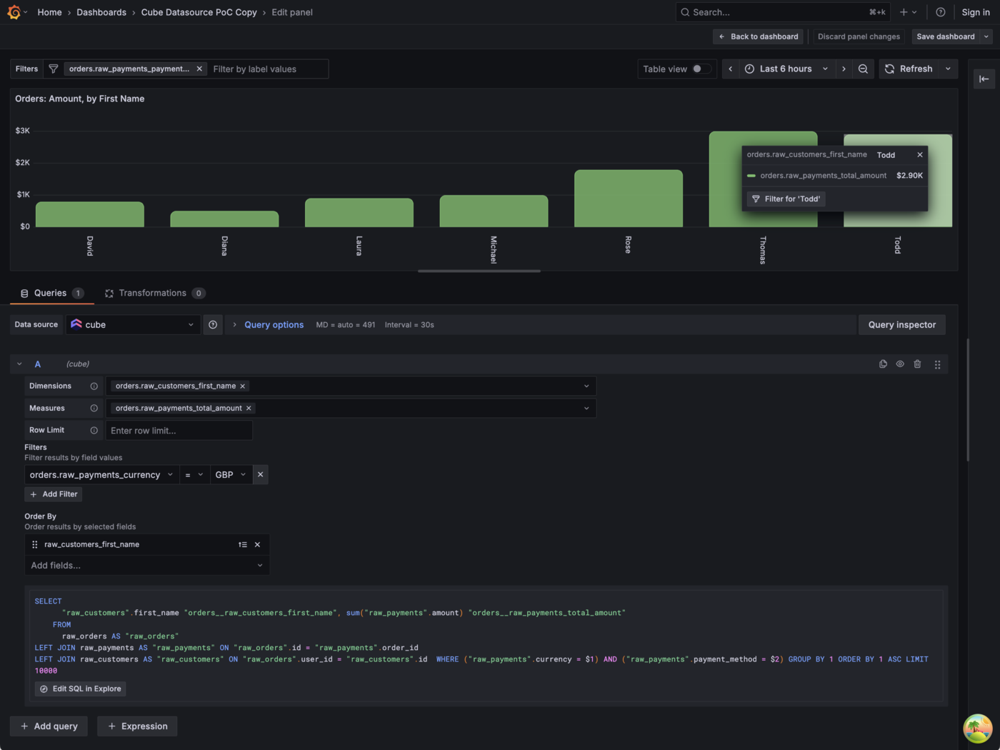

# Cube Datasource Plugin for Grafana

[](https://grafana.com/grafana/plugins/grafana-cube-datasource/)
[](https://grafana.com/grafana/plugins/grafana-cube-datasource/)
[](https://grafana.com/grafana/plugins/grafana-cube-datasource/)
[](LICENSE)

> **Experimental**: This plugin is experimental. Features may be incomplete or have known limitations, and you should expect some rough edges. See [Experimental Status](#experimental-status) for details.

Connect Grafana to [Cube](https://cube.dev/) for semantic layer analytics. Query measures and dimensions, apply filters, and visualize your data—without writing SQL.



## Why Use This Plugin?

This plugin brings a **true semantic layer** to Grafana for the first time. By connecting to Cube, you get:

- **No more writing SQL** — Query your data using pre-defined measures and dimensions
- **No more writing JOINs** — Cube handles the complexity of joining tables for you
- **Single source of truth** — Business metrics are defined once in Cube and used consistently across all dashboards
- **Lower barrier to entry** — Non-technical users can build dashboards without SQL knowledge
- **Scalable complexity** — Start simple, but analytics queries can grow as sophisticated as you need
- **More maintainable dashboards** — Panels require far less code when using semantic definitions
- **Cross-panel filtering** — Use AdHoc filters to drill down across Table and Bar Chart panels, enabling data exploration for dashboard viewers

## Features

### Query Builder

The visual query builder supports:

| Feature | Description |
|---------|-------------|
| **Dimensions** | Select one or more dimensions to group your data |
| **Measures** | Select one or more measures to aggregate |
| **Limit** | Control the number of rows returned (defaults to 10,000; maximum 50,000). See [Cube's row limit documentation](https://cube.dev/docs/product/apis-integrations/core-data-apis/queries#row-limit) for details. |
| **Filters** | Filter your query before aggregation |
| **Order** | Sort results by any selected dimension or measure |

### Filtering

Per-panel filters support:

- **Filter members**: Dimensions only (measure filtering not yet supported)
- **Operators**: `equals` and `notEquals`, each accepting multiple values
- **Multiple filters**: Combine with AND (intersection)

### Dashboard Variables

#### AdHoc Filters

Clicking a value in a **Table** or **Bar Chart** panel creates or updates an AdHoc dashboard variable scoped to the Cube datasource. This enables powerful cross-panel filtering and data exploration.

AdHoc filters can also be edited directly in the dashboard UI to add additional filter members, operators, and values. The same operator limitations apply (`=` and `!=` only).

**How filters combine:**
- Multiple AdHoc filters combine with AND (intersection)
- AdHoc filters combine with per-panel filters using AND (intersection)

#### Time Range Filtering

To filter all panels by the dashboard time picker:

1. Create a dashboard variable with identifier `cubeTimeDimension`
2. Set its value to the time dimension field you want to filter by (e.g., `order_date`)
3. The dashboard's `$__from` and `$__to` variables will automatically apply to all panels

## Known Limitations

This plugin is experimental. Current limitations include:

| Limitation | Details |
|------------|---------|
| **Cube Cloud authentication** | Authentication does not yet work with Cube Cloud. Self-hosted Cube (dev and production mode) works correctly. |
| **Technical field names** | Dimension and measure names currently use full technical identifiers (e.g., `orders.customer_name`) rather than human-readable labels. This is due to a dependency on how Grafana implements AdHoc filters. |
| **Filter operators** | Currently only `equals` and `notEquals` are supported |
| **Filter members** | Only dimensions can be used as filter members (no measure filtering) |
| **Cross-panel filtering** | Depends on Grafana AdHoc filters. Currently works with Table and Bar Chart panels only |

## Experimental Status

> **Not for production use.** This plugin is experimental and is not meant to be used in production or critical environments.

This plugin is marked as **experimental**, meaning:

- Features may be incomplete or have known limitations
- Backward compatibility is not guaranteed between versions
- The data model, configuration, or UI might change, potentially breaking dashboards
- The risks are unknown and potentially high
- Support is limited to GitHub issues; no SLA is provided

**Do not use this plugin in production environments.** It is intended for:
- Testing and evaluation
- Development environments
- Providing early feedback
- Validating use cases before production readiness

Track the [CHANGELOG](CHANGELOG.md) for breaking changes and stability updates.

---

## About Cube

Cube is a semantic layer that sits between your data warehouse and your applications. It provides a consistent API for querying data, handles caching, security, and pre-aggregations. This Grafana plugin enables you to leverage Cube's powerful data modeling capabilities directly in your Grafana dashboards.

---

# Development

## Getting started

### Setup

1. Install dependencies

   ```bash
   npm install
   ```

2. Update [Grafana plugin SDK for Go](https://grafana.com/developers/plugin-tools/key-concepts/backend-plugins/grafana-plugin-sdk-for-go) dependency to the latest minor version:

   ```bash
   go get -u github.com/grafana/grafana-plugin-sdk-go
   go mod tidy
   ```

### Cube SDK parity guidance

This plugin backend is written in Go, but Cube protocol semantics are primarily
defined by Cube's JavaScript SDK (`@cubejs-client/core`) and Cube REST docs.

When changing protocol-level behavior (for example `/v1/load` handling, retry
behavior, timeout/cancellation semantics, status/error mapping, progress fields):

- Check Cube JS SDK behavior first (local path: `../cube/packages/cubejs-client-core/src/index.ts`)
- Check Cube REST docs (local path: `../cube/docs/pages/product/apis-integrations/rest-api.mdx`)
- Mirror SDK behavior by default unless there is a clear Grafana/backend reason to diverge
- If intentionally diverging, document rationale and user impact in the PR and add tests
  that explicitly cover the divergence

### Development Workflow (Recommended)

For the best development experience with automatic reloading of both frontend and backend changes:

**Terminal 1 - Frontend Development:**

```bash
npm run dev
```

**Terminal 2 - Backend Development with Auto-reload:**

```bash
DEVELOPMENT=true docker compose up --build
```

This setup provides:

- **Frontend hot-reloading**: Changes to TypeScript/React code automatically refresh the browser
- **Backend auto-rebuilding**: Changes to Go code automatically rebuild and reload the plugin
- **Built-in debugging**: Delve debugger available on port 2345

The docker-compose setup includes Cube and Postgres with sample data, starting:

- Postgres with JaffleShop sample data pre-loaded
- Cube connected to Postgres
- Grafana with the plugin loaded

Once running, you can:

1. **Access Grafana** at: http://localhost:3000

   - Login with username: `admin`, password: `admin`
   - The Cube datasource is automatically provisioned and ready to use
   - A PostgreSQL datasource is also provisioned for direct database access
   - Sample dashboards are pre-loaded for testing

2. **Test the Cube API directly** (authentication is not required):
   ```console
   curl -G --data-urlencode 'query={"dimensions":["orders.raw_customers_first_name"],"measures":["orders.raw_payments_total_amount","orders.raw_orders_count"]}' http://localhost:4000/cubejs-api/v1/load | jq '.data[0]'
   ```

### Individual Build Commands

For production builds or manual development:

**Backend builds:**

```bash
# Build for all platforms
mage -v

# Build for M4 Mac (ARM64 Linux)
mage -v build:linuxARM64

# List all available Mage targets
mage -l
```

**Frontend builds:**

```bash
# Production build
npm run build

# Alternative Docker setup (without auto-reload)
npm run server
```

**Testing:**

```bash
# Run unit tests with file watching
npm run test

# Run unit tests once (for CI)
npm run test:ci

# Run E2E tests (using Playwright)
# First, spin up a Grafana instance to test against:
npm run server
# Optionally specify Grafana version (recommended dev target):
GRAFANA_VERSION=12.3.3 npm run server
# Validate minimum supported version compatibility:
GRAFANA_VERSION=12.2.5 npm run server
# Then run the E2E tests:
npm run e2e
```

**Code Quality:**

```bash
# Run linter
npm run lint

# Auto-fix linting issues
npm run lint:fix
```

## CI/CD and Distribution

This plugin uses Grafana's standardized CI/CD workflows for automated building, testing, and publishing.

## Automated Build Pipeline

The CI pipeline automatically:

- **Builds and tests** the plugin on every push and PR
- **Creates signed ZIP files** for all supported platforms
- **Uploads artifacts** to GitHub Actions and GCS storage
- **Runs E2E tests** using Playwright

### Key Developer Questions

**Q: Does the CI pipeline produce a signed plugin ZIP?**  
A: Yes, the CI automatically builds and signs ZIP files for all platforms (universal + per-architecture for the Go backend).

**Q: Where are the ZIP files uploaded?**  
A: ZIP files are uploaded to:

- GitHub Actions artifacts (for PRs and development)
- GCS storage (for release artifacts)

**Q: How can I use these ZIPs on Grafana Cloud?**  
A: For Grafana Cloud deployment, use the **"Plugins - CD"** workflow in the Actions tab to publish to dev/ops/prod environments.

## Releasing

This repository uses a **two-step release process**:

1. **GitHub Release** (via `release.yml`) — Created automatically when you push a version tag
2. **Catalog Publishing** (via `publish.yaml`) — Manual workflow to publish to Grafana Cloud environments

### Why Two Separate Workflows?

We want GitHub releases with downloadable artifacts to be available **as soon as a version is tagged**, regardless of whether it's published to the Grafana catalog. This allows:

- QA and testers to download and verify the plugin before catalog publishing
- Transparency about what version exists, even if only deployed to dev/ops
- A clear audit trail of all released versions

The standard `plugin-ci-workflows` only creates GitHub releases when publishing to prod. Our custom `release.yml` fills this gap by creating releases on any tag push.

### Creating a Release

Since `main` is protected, releases are a two-step process:

**Step 1: Version bump PR**

```bash
# Create a release branch
git checkout -b release/v1.2.3

# Bump version (updates package.json and package-lock.json)
npm version patch --no-git-tag-version  # or minor/major

# Commit the version bump
git add package.json package-lock.json
git commit -m "chore: release v1.2.3"

# Push and create PR
git push -u origin release/v1.2.3
```

Wait for CI to pass, then merge the PR.

**Step 2: Tag the release**

```bash
# After merging, pull main and create the tag
git checkout main && git pull
git tag v1.2.3
git push origin v1.2.3
```

The tag push triggers the `release.yml` workflow, which creates a GitHub release with signed plugin artifacts. You can then publish to the catalog whenever you're ready.

## Publishing Workflow

To publish the plugin to the Grafana catalog:

1. Go to **Actions** → **"Plugins - CD"** → **"Run workflow"**
2. Choose target environment: `dev`, `ops`, `prod-canary`, or `prod`
3. The workflow will build, sign, and publish automatically

### Testing Feature Branches

You can deploy any branch (not just `main`) to test changes before merging:

**Why:** This lets you test your feature in a real Grafana Cloud environment before merging to `main`, catching integration issues early.

**How:**

- Set **branch** to your feature/PR branch name (e.g., `feature/new-query-builder`)
- Set **environment** to `dev` (safe testing environment)
- Plugin version becomes `x.y.z+COMMIT_SHA` (e.g., `1.2.3+a1b2c3d4`)

**Result:** Your exact commit gets deployed to Grafana Cloud dev with a unique version identifier, allowing safe testing without affecting other developers or environments.

## For External Contributors & Open Source Community

**This section is for developers outside Grafana Labs** who want to fork this repository and distribute their own version independently.

### CI/CD for External Developers

The GitHub Actions workflows in this repository (`push.yaml` and `publish.yaml`) are designed for Grafana's internal infrastructure and **will not work** for external contributors.

If you're forking this repo, you should:

1. **Revert to the previous CI workflows** that come with a newly bootstrapped plugin - these contain the basic build, test, and packaging logic without Grafana-specific deployment steps
2. **Use manual plugin signing** for distribution to your own Grafana instances

### Manual Plugin Signing

For private distribution or local development:

```bash
npm install -g @grafana/sign-plugin
npx @grafana/sign-plugin --rootUrls https://your-grafana-instance.com
```

This allows you to sign and distribute your fork without going through Grafana's official plugin catalog or internal infrastructure.

## Learn more

Below you can find source code for existing app plugins and other related documentation.

- [Basic data source plugin example](https://github.com/grafana/grafana-plugin-examples/tree/master/examples/datasource-basic#readme)
- [`plugin.json` documentation](https://grafana.com/developers/plugin-tools/reference/plugin-json)
- [How to sign a plugin?](https://grafana.com/developers/plugin-tools/publish-a-plugin/sign-a-plugin)
